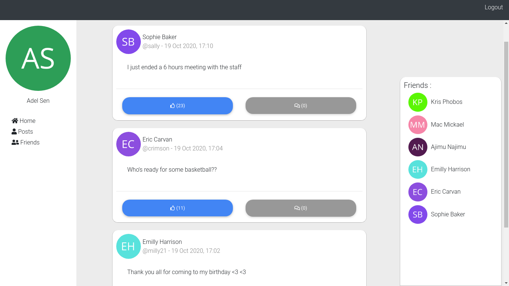
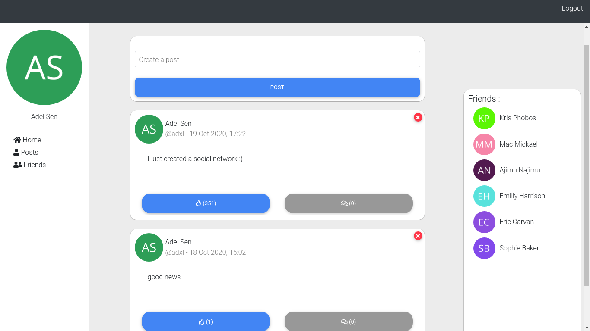
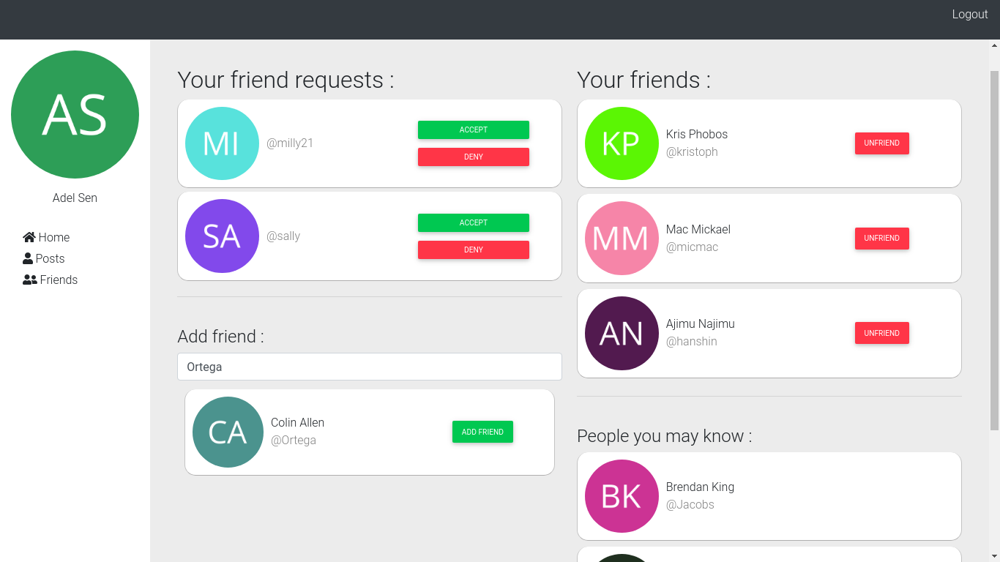

# Herme.io

[Herme.io](#) is a social network made with NodeJS and ReactJS.

This repository contains the source code for the client side. For the server side check it out [here](https://github.com/adxl/herme.io_server).

## Features

What you can do in Herme.io:

 - Create and delete posts 
 - Add friends
 - See friends' posts in feed
 - Like friends' posts (or your's ;))
 - And much more features are coming soon

## Screenshots

- ### Feed

    

- ### Posts

    

- ### Friends

    

## License

[MIT](https://github.com/adxl/herme.io_client/blob/master/LICENSE.md) &copy; [Adel Senhadji](https://github.com/adxl)

